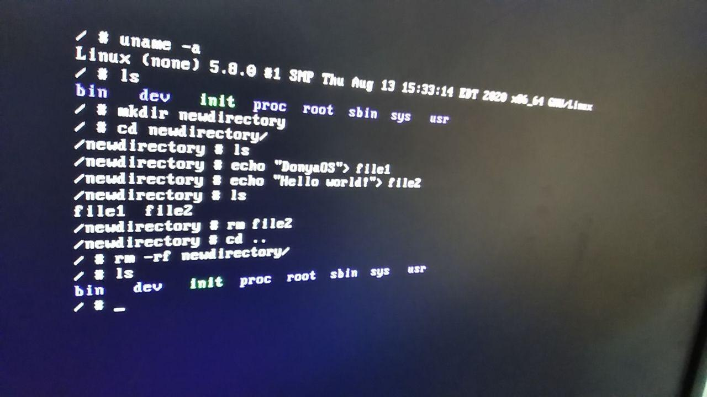

# Donya OS

DonyaOS is a Operating System. A kind of Linux distribution built using package management system. Unlike a binary software distribution, the source code is compiled locally according to the user's preferences and is often optimized for the specific type of computer.


Based on an original works [Minimal Linux Script ](https://github.com/ivandavidov/minimal-linux-script) by [John Davidson](https://github.com/ivandavidov)

**Join team by send a message at [this issue](https://github.com/DonyaOS/Donya/issues/4)**

> This Linux distribution is not yet ready and complete and we need the help of others.



### Demo Video


Produced ISO file: [DonyaOS.iso](DonyaOS.iso) (In development mode)

### Preparation

```
...Download dependency files and decompress or uncomment from donya.sh...
bash donya.sh
```

### Network


***Configure on VirtulaBox***

```
ifconfig eth0 10.0.2.16 netmask 255.255.255.0
route add default gw 10.0.2.2
```


### Contribution

Please make sure to read the Contributing Guide before making a pull request. If you have a Donya-related project/feature/tool, add it with a pull request to this curated list!

Thank you to all the people who already contributed to DonyaOS!

### License

**MIT**

Copyright (c) 2020-present, Max Base
