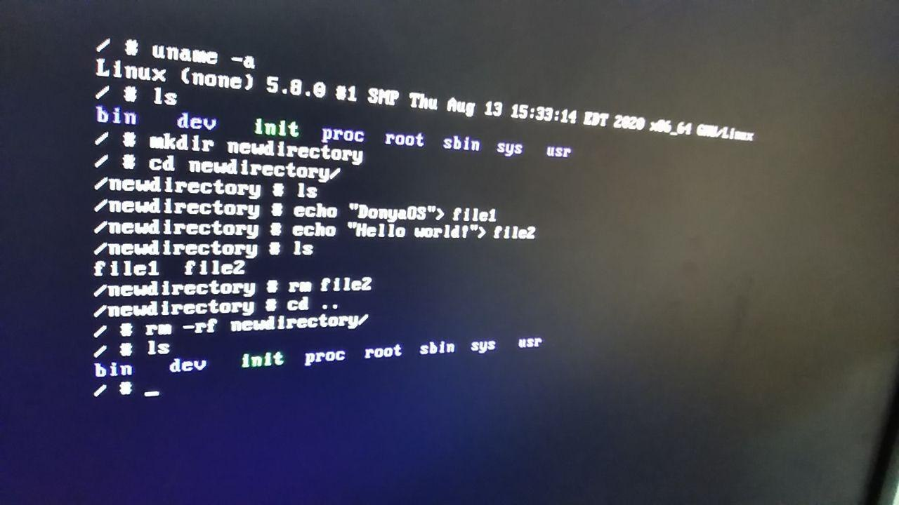
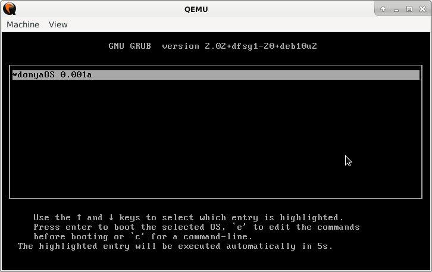
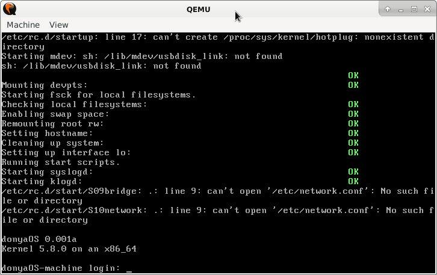

# Donya OS

[](LICENSE)
[](#donya-os)
[](#donya-os)

- [Demo Video](#demo-video)
- [Preparation](#preparation)
- [Network](#network)
- [Commands](#commands)
- [Contribution](#contribution)
- [Team members](#team-members)
- [License](#license)

Donya Operating System, Yet Another GNU/Linux distro built using a package management system.

Unlike a binary software distribution, the source code is compiled locally according to the user's preferences and is often optimized for the specific type of computer.

> This Linux distribution is not yet ready, we need the help of others. **Join the team by sending a message at [this issue](https://github.com/DonyaOS/Donya/issues/4)**



## Demo Video


Produced ISO file: [DonyaOS.iso](DonyaOS.iso) (In development mode)

## DonyaOS Installation Guide

# Installation 
## Install prebuild Donya (Fastest way to run Donya)

You need to use compressed package `donyaOS-build.tar.xz`

Suppose we have another hard disk `sdb` or partition to install donyaOS on it.
To run donya we must create a 100 MB partition in it.

### Create home for our new OS

```
DONYA_PATH=$HOME/donayos/
mkdir -p $DONYA_PATH $DONYA_PATH/donya
cd $DONYA_PATH
```
### Format the partition

If our target partition is `/dev/sdb1` format with below command.

`sudo mkfs.ext4 /dev/sdb1`

### Mount new partiotion `sdb1` to file system

`sudo mount /dev/sdb1 "$DONYA_PATH"/donya/`

### Download and extract donyaOS archive file inside it

```
wget https://github.com/DonyaOS/Donya/raw/refs/heads/main/donyaOS-build.tar.xz
sudo tar xJvf "$DONYA_PATH"/donyaOS-build.tar.xz -C "$DONYA_PATH/donya/
```


### Install grub in MBR

```
sudo grub-install --root-directory="$DONYA_PATH/donya/ /dev/sdb
```

### Run Donya with qemu(emulator)

`sudo qemu-system-x86_64 /dev/sdb`

---





---

## Build from source

### Preparation

```
...Download dependency files and decompress or uncomment from donya.sh...
bash donya.sh
```


## Network

***Configure on VirtualBox***

```
ifconfig eth0 10.0.2.16 netmask 255.255.255.0
route add default gw 10.0.2.2
```


## Commands

Currently available applets include:

```
[, [[, adjtimex, ar, arp, arping, ash, awk, basename, blockdev,
brctl, bunzip2, bzcat, bzip2, cal, cat, chgrp, chmod, chown, chroot,
chvt, clear, cmp, cp, cpio, crond, crontab, cttyhack, cut, date, dc,
dd, deallocvt, depmod, df, diff, dirname, dmesg, dnsdomainname,
dos2unix, dpkg, dpkg-deb, du, dumpkmap, dumpleases, echo, ed, egrep,
env, expand, expr, false, fdisk, fgrep, find, fold, free,
freeramdisk, ftpget, ftpput, getopt, getty, grep, groups, gunzip,
gzip, halt, head, hexdump, hostid, hostname, httpd, hwclock, id,
ifconfig, ifdown, ifup, init, insmod, ionice, ip, ipcalc, kill,
killall, klogd, last, less, ln, loadfont, loadkmap, logger, login,
logname, logread, losetup, ls, lsmod, lzcat, lzma, md5sum, mdev,
microcom, mkdir, mkfifo, mknod, mkswap, mktemp, modinfo, modprobe,
more, mount, mt, mv, nameif, nc, netstat, nslookup, od, openvt,
passwd, patch, pidof, ping, ping6, pivot_root, poweroff, printf, ps,
pwd, rdate, readlink, realpath, reboot, renice, reset, rev, rm,
rmdir, rmmod, route, rpm, rpm2cpio, run-parts, sed, seq,
setkeycodes, setsid, sh, sha1sum, sha256sum, sha512sum, sleep, sort,
start-stop-daemon, stat, static-sh, strings, stty, su, sulogin,
swapoff, swapon, switch_root, sync, sysctl, syslogd, tac, tail, tar,
taskset, tee, telnet, telnetd, test, tftp, time, timeout, top,
touch, tr, traceroute, traceroute6, true, tty, tunctl, udhcpc,
udhcpd, umount, uname, uncompress, unexpand, uniq, unix2dos, unlzma,
unxz, unzip, uptime, usleep, uudecode, uuencode, vconfig, vi, watch,
watchdog, wc, wget, which, who, whoami, xargs, xz, xzcat, yes, zcat
```

## lfs donyaOS

We have build [linux from scratch](http://linuxfromscratch.org/lfs/view/stable/index.html) version of donyaOS.

[get donyaOS-lfs](https://ufile.io/sgea1rxg)

We highly recommend using a virtual machine guest OS to save real machine.

This method tested on Debian buster net-install with an extra hard disk to install **donyaOS-lfs** on it.

We want to use `/dev/sdb` device
The extra partition is `/dev/sdb1`

- Create new partition on target device

`fdisk /dev/sdb`
with these switches
o, n, p, a

- format new partition

`mkfs.ext4 /dev/sdb1`

- mount partition

`mount /dev/sdb1 /mnt`

Copy **donyaOS-lfs** image to partition

`cd /mnt
tar xvf ~/donyaOS_backup.tar.xz .`

- Update grub to find new distro

`# update-grub2`

In next boot you can log in to **donyaOS-lfs** from the grub menu.


### How to test LFS in virtual machine

After download `lfs.fsa` file

1. Install a linux distro in virtual machine
(we recommends debian stable netinstall)

2. Add a new hard disk 8GB

3. Boot to distro

4. Partition and format new hdd

   - `fdisk` # create partition
   - `mkfs.ext4 /dev/sdb1` # format new created partition

5. Extract `lfs.fsa` to destination partition

   - `mount /dev/sdb1 /mnt/ -r` #mount read only
   - `fsarchiver restfs lfs.fsa id=0,dest=/dev/sdb1` #extract

6. Update grub to detect new distro

   - `grub2-update`

7. Reboot system

## Contribution

Please make sure to read the [Contributing Guide](CONTRIBUTING.md) before making a pull request.
If you have a Donya-related project/feature/tool, add it with a pull request to this curated list!

Thank you to all the people who already contributed to DonyaOS!

**Join the team by sending a message at [this issue](https://github.com/DonyaOS/Donya/issues/4)**

## Team members

EsmaeelE, Prince Kumar, Emil Sayahi, Iniubong Obonguko, Hooman, John Bampton and Max Base

## License

MIT License Copyright (c) 2020-present, Max Base
Donya OS Community
